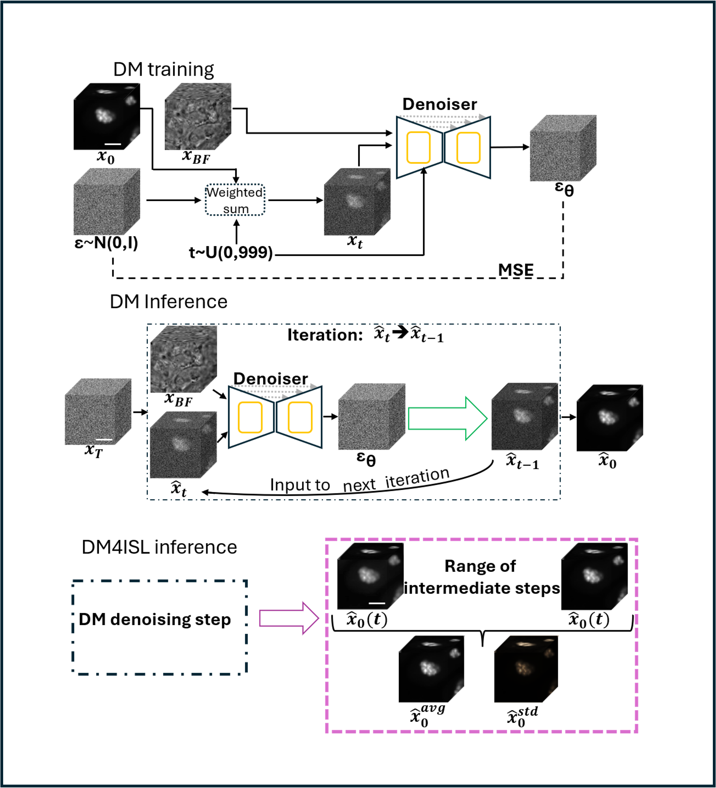

# DM4ISL (Diffusion model for in silico labeling)

DM4ISL: a diffusion model-based high-fidelity and uncertainty-aware in silico labeling of fluorescence images<br>
Oded Rotem, Orit Kliper-Gross, Assaf Zaritsky

Manuscript currently under review. A link to the publication will be added upon publication.

## Abstract
In silico labeling predicts organelle-specific localizations from label-free images, potentially enabling longitudinal and multiplexed live-cell imaging. Here we present DM4ISL (Diffusion Model for In Silico Labeling), a high-fidelity and uncertainty-aware model that overcomes current limitations, such as blurry or structurally inaccurate predictions, by resolving the intrinsic entanglement of biological signal and photon noise that characterizes fluorescence imaging. By leveraging the iterative nature of diffusion, DM4ISL employs a step-wise self-ensemble averaging approach that marginalizes these stochastic fluctuations, preventing the overfitting to noise that typically degrades standard final-step predictions. Benchmarking across six organelles demonstrates that DM4ISL systematically outperforms state-of-the-art architectures in structural fidelity, as confirmed by both pixel-based and application-specific metrics. By using the standard deviation across intermediate denoising steps, DM4ISL generates localized uncertainty maps that automatically detect erroneous predictions at inference time. By providing high-fidelity predictions alongside built-in reliability metrics, DM4ISL establishes a new standard for trustworthy, data-driven discovery in cell biology.

## Framework
<p align="center">
  
</p>
<p>
  <strong>The DM4ISL architecture and its averaging-based inference routine.</strong><br>
  <strong>DM training:</strong> The denoiser learns to predict synthetically added Gaussian noise from noisy fluorescence images conditioned on the corresponding brightfield image.<br>
  <strong>DM inference:</strong> A random noise image is iteratively refined into a fluorescence prediction while being conditioned on the corresponding brightfield image.<br>
  <strong>DM4ISL inference:</strong> DM4ISL computes the mean and standard deviation of fluorescence predictions across a range of intermediate denoising steps. The averaged prediction is used as the final fluorescence prediction, while the standard deviation is used to generate a localized uncertainty map.
</p>

## Overview
DM4ISL is a framework for predicting organelle fluorescence from label-free microscopy images using diffusion models. It introduces an averaging-based inference strategy that improves prediction fidelity while providing localized uncertainty estimation. This repository includes the source code for training, inference, and results analysis.

## Data

### Original dataset
The original paired brightfield (BF) and fluorescence (FL) images were obtained from the Allen Institute for Cell Science:
https://open.quiltdata.com/b/allencell/tree/aics/pipeline_integrated_cell/
In the paper, we trained separate models for six organelles: DNA, Nuclear Envelope, Nucleoli, Actin Filaments, Mitochondria, and Microtubules.

To reproduce the preprocessing pipeline and organize the downloaded data into the directory structure expected by this repository, use the data preparation scripts provided in the MaskInterpreter repository:
https://github.com/zaritskylab/MaskInterpreter/blob/main/md/data.md

### Benchmark test set
The benchmark test set used for quantitative evaluation is available from the BioImage Archive:
https://www.ebi.ac.uk/biostudies/bioimages/studies/S-BIAD3820
It contains six organelle-specific held-out test sets (DNA, Nuclear Envelope, Nucleoli, Actin Filaments, Mitochondria, and Microtubules). Each study component includes paired brightfield and fluorescence image patches together with predictions generated by multiple in silico labeling models (DDPM, DM4ISL, GAN, and U-Net), spatial standard deviation maps, uncertainty maps, and manual annotations comprising expert assessment of substantial prediction errors, together with evaluation of the corresponding uncertainty maps. This dataset can be used together with the pretrained models to reproduce the quantitative results reported in the paper.

### Pretrained models and example data
Pretrained models for all six organelles, the train/test split lists, and several Nuclear Envelope training FOVs are available on Zenodo (link will be provided soon).
The example Nuclear Envelope data are intended for demonstrating the workflow and verifying that the code runs correctly, but are not sufficient to reproduce the quantitative results reported in the paper.
To reproduce the paper results, either train the models on the full dataset or use the pretrained models together with the benchmark test set available from the BioImage Archive.


## Installation and Setup 

Clone the repository:
```bash
git clone https://github.com/zaritskylab/DM4ISL.git
cd DM4ISL
```

Create a Python 3.9 environment and install the required dependencies:
```bash
conda create -n dm4isl_env python=3.9
conda activate dm4isl_env
pip install -r requirements.txt
pip install notebook
```

Training was performed on NVIDIA RTX6000 GPUs. GPUs with similar memory capacity are recommended for training.
Before running the notebooks, update the `main_path` variable to point to your local project directory.

## Example Notebooks

### TRAINING notebook

This notebook demonstrates how to train a DM4ISL model from paired brightfield (BF) and fluorescence (FL) images.
Starting from full field-of-view (FOV) images, the notebook generates the train/test split, extracts image patches, trains the model, and saves the held-out test patches for subsequent inference. The generated BF and FL test patches are stored under the `data` directory and are used by the `INFERENCE` notebook.

### INFERENCE notebook

This notebook demonstrates how to generate fluorescence predictions from brightfield images using a trained DM4ISL model.
The notebook expects BF test patches located in the `data` directory. These can either be generated by the `TRAINING` notebook or downloaded directly from the BioImage Archive benchmark dataset.
You may use either the pretrained models available on Zenodo (recommended), models trained using the `TRAINING` notebook.
The notebook generates fluorescence predictions, spatial standard deviation maps, and uncertainty maps for the input images.

### RESULTS_ANALYSIS notebook

This notebook reproduces the evaluation pipeline described in the paper.
Using the benchmark test set from the BioImage Archive together with the pretrained models from Zenodo, it computes all evaluation metrics reported in the manuscript and reproduces the quantitative results.
For demonstration purposes, the notebook can also be run using the smaller example dataset generated by the `TRAINING` and `INFERENCE` notebooks, although these results are intended only to verify the workflow and not to reproduce the reported performance.

## Acknowledgement
Our work builds upon MONAI's diffusion models framework. We adapted the image-to-image translation for 3D microscopy images and extended it to support the DM4ISL inference procedure.
[https://github.com/Project-MONAI/MONAI](https://github.com/Project-MONAI/GenerativeModels/tree/main/tutorials/generative)